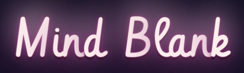

&nbsp;

## The Brief

Create a trivia browser game. Model and test the game logic and then display it in the browser for a user to interact with.

- The game should display a question and four potential answers for the player to choose from.
- The player should be able to choose a category and difficulty level.
- The game should have a timer to make it more challenging.
- The game should keep track of the player's score and display it to the player while they play and at the end of the round.

&nbsp;

## Technologies Used

&nbsp;

## Installation

1. Clone this repo
2. Run `npm i` in the client folder
3. Run `npm i` in the server folder

Once the dependencies have finished installing:

4. Run `npm start` in both the client and server folders
5. Open http://localhost:3006/ in your browser
